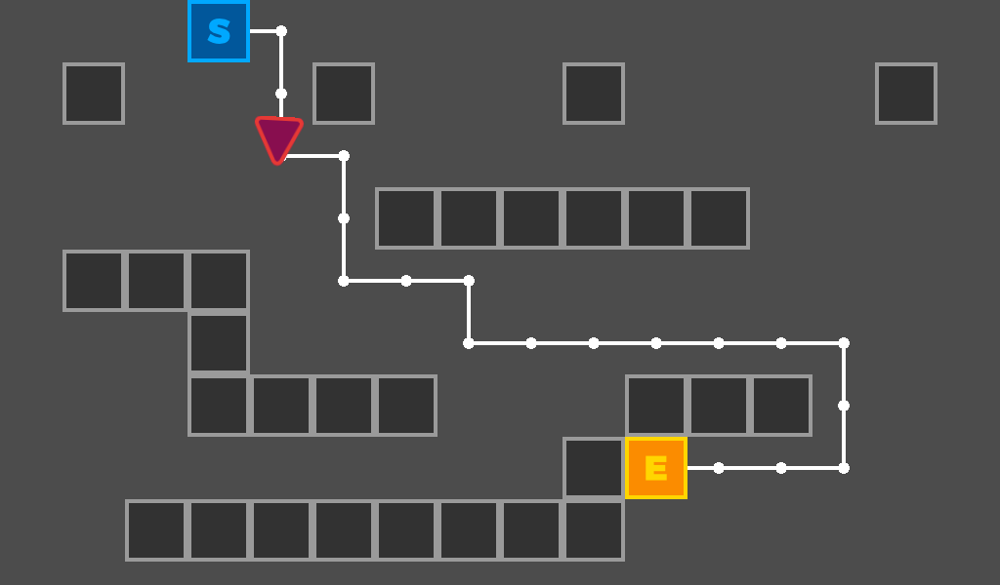

# This Repo

This repo is a port of Godot's own [navigation_astar](https://github.com/godotengine/godot-demo-projects/tree/a9c63035daeec7d26ed1714b262d5ad2d9f45927/2d/navigation_astar)
example to C#.

I generally tried to follow the Godot [style guidelines](https://docs.godotengine.org/en/stable/getting_started/scripting/c_sharp/c_sharp_style_guide.html),
except for BSD-style brackets. I just strongly prefer the [Java variant of K&R](https://en.wikipedia.org/wiki/Indentation_style#Variant:_Java) I'm used to.

# What's in this repo?

[Character.cs](Character.cs) and [PathfindAstar.cs](PathfindAstar.cs) are both new, ports of their GDScript analogs. There are new nodes in the
main Game scene suffixed with "Cs" that use them, while the original nodes are still there but disabled. I tried to keep the method names and order
consistent to make it easier to compare them.

# Why?

1. Practice; it's been a couple years since I used Godot.
2. Testing C# viability; seems like it works, but I ran into the [renaming issue](https://github.com/godotengine/godot/issues/12917), and other quirks, like
you have to rebuild before exported properties are updated. Some APIs are a bit rough too, due to a lack of a Vector2Int-style class. Pooled arrays are missing,
so there's a fair bit of juggling between lists and arrays. I'm still not 100% clear when to use C#'s List vs Godot's Array vs C#'s Array.
3. I plan on using the C# version for another project.
4. Converting code from one language to another is kinda fun.

# License

Same as the original repo at time of writing: MIT.

*Everything below this line is from the original README.*

---

# Grid-based Navigation with Astar

This is an example of using AStar for navigation in 2D,
complete with Steering Behaviors in order to smooth the movement out.

Language: GDScript

Renderer: GLES 2

## Screenshots

